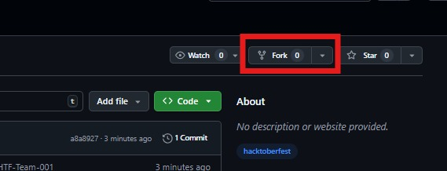

# Pariksha Sarthi - Automated Exam Seating Planner

## Project Overview

Pariksha Sarthi is a comprehensive automated exam seating planner system designed for educational institutions. It provides efficient management of exam schedules, seating arrangements, and student monitoring.

## Features

- **Admin Dashboard**: Complete exam management system
- **Student Dashboard**: Student portal for exam information
- **Invigilator Dashboard**: Monitoring and supervision tools
- **Automated Seating Arrangement**: AI-powered seating optimization
- **Real-time Monitoring**: Live attendance and activity tracking
- **CSV Data Management**: Bulk student and exam data handling

## Technology Stack

### Frontend
- React.js with modern UI components
- Tailwind CSS for styling
- Custom UI components library

### Backend
- Python Flask server
- RESTful API endpoints
- CSV data processing

## Project Structure

```
Pariksha_Sarthi/
├── frontend/          # React.js frontend application
├── backend/           # Python Flask backend
├── scripts/           # Setup and utility scripts
├── tests/             # Test files
└── docs/              # Documentation files
```

## Getting Started

### Prerequisites
- Node.js (for frontend)
- Python 3.x (for backend)
- Git

### Installation

1. Clone the repository:
```bash
git clone https://github.com/Amgothvijaykumar/HTF25-Team-128.git
cd HTF25-Team-128
```

2. Setup Frontend:
```bash
cd frontend
npm install
npm start
```

3. Setup Backend:
```bash
cd backend
pip install -r requirements.txt
python server.py
```

## Usage

1. Access the application through your web browser
2. Login with appropriate credentials (Admin/Student/Invigilator)
3. Use the dashboard to manage exams, view schedules, or monitor activities

## Contributing

1. Fork the repository
2. Create a feature branch (`git checkout -b feature/AmazingFeature`)
3. Commit your changes (`git commit -m 'Add some AmazingFeature'`)
4. Push to the branch (`git push origin feature/AmazingFeature`)
5. Open a Pull Request

## License

This project is part of the CBIT Hackathon 2025.

## Team

HTF25-Team-128 - CBIT Hackathon Participants

---

## GitHub Submission Guide

In this Readme, you will find a guide on how to fork this Repository, add files to it, and make a pull request to contribute your changes.

<details open>
<summary><h3>1. Login to your GitHub Account</h3></summary>
<br>
<p>Go to <a href="https://github.com">github.com</a> to log in.</p>
<ul>
   <li>Open the <a href="https://github.com/cbitosc/HTF25-Team-128">current repo</a> in a new tab.</li>
   <li>Perform all operations in the newly opened tab, and follow the current tab for instructions.</li>
</ul>
</details>

<details open>
<summary><h3>2. Fork the Repository</h3></summary>
<br>
<p align="center">
  
</p>
<ul>
 <li>In the newly opened tab, on the top-right corner, click on <b>Fork</b>.</li>
 <li>Enter the <b>Repository Name</b> as <b>HTF25-Team-128</b>.</li>
 <li>Then click <b>Create Fork</b>, leaving all other fields as default.</li>
 <li>After a few moments, you can view your forked repo.</li>
</ul>
</details>

<details open>
<summary><h3>3. Clone your Repository</h3></summary>
<br>
<ul>
 <li>Click on <b>Code</b> and copy the <b>web URL</b> of your forked repository.</li>
 <li>Open terminal on your local machine.</li>
 <li>Run this command to clone the repo:</li>
<pre><code>git clone https://github.com/your-username/HTF25-Team-128.git</code></pre>
</ul>
</details>

<details open>
<summary><h3>4. Adding files to the Repository</h3></summary>
<br>
<ul>
 <li>While doing it for the first time, create a new branch for your changes:</li>
<pre><code>git checkout -b branch-name</code></pre>
 <li>Add files or modify existing ones.</li>
 <li>Stage your changes:</li>
<pre><code>git add .</code></pre>
 <li>Commit your changes:</li>
<pre><code>git commit -m "Descriptive commit message"</code></pre>
 <li>Push your branch to your fork:</li>
<pre><code>git push origin branch-name</code></pre>
</ul>
</details>

<details open>
<summary><h3>5. Create a Pull Request</h3></summary>
<br>
<ul>
 <li>Click on the <b>Contribute</b> button in your fork and choose <b>Open Pull Request</b>.</li>
 <li>Leave all fields as default, then click <b>Create Pull Request</b>.</li>
 <li>Wait a few moments; your PR is now submitted.</li>
</ul>
</details>

## Thanks for participating!
